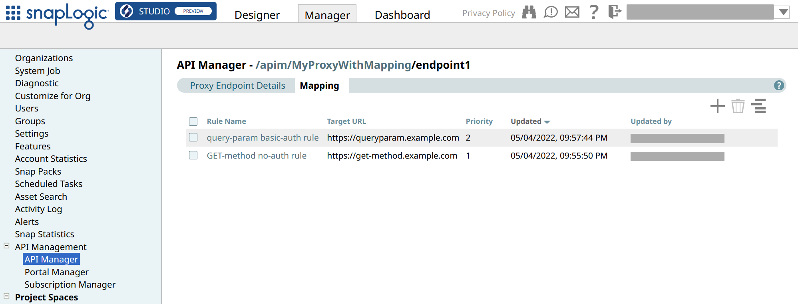
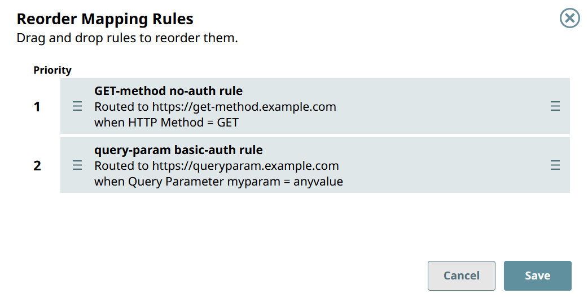

# Prioritize the Proxy Endpoint Mapping Rules

1.  

2.  

3.  

4.  

5.  

    

6.  Click .

7.  In **Reorder Mapping Rules**, drag and drop the rules into the priority order that you want.

    

8.  Click **Save**.

